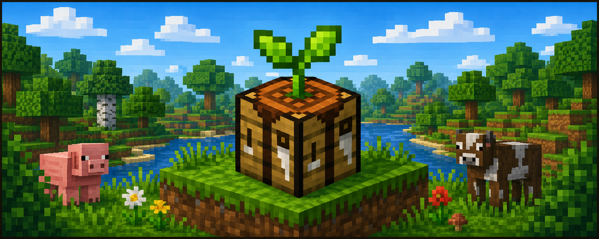

<div align="center">

<!-- Project banner -->



# 🐾 Animal Friendly Craft Add-on

**Animal-friendly crafting alternatives without having to harm animals in Minecraft Bedrock.**

[🇧🇷 Português](../README.md) • 🇺🇸 English

<!-- Badges -->

<!-- Add later: version, Minecraft Bedrock, license, status, etc. -->

</div>

---

## 🌱 About

**Animal Friendly Craft Add-on** adds alternative crafting methods for obtaining materials that are normally associated with animals, without having to harm them.

The goal is to preserve the Minecraft survival experience while offering new crafting paths that integrate with vanilla items whenever possible.

---

## ✨ Features

The add-on currently includes:

* 🧵 **Synthetic Leather**

  * Crafted using renewable and accessible survival resources.
  * Can be converted into vanilla leather.
  * Compatible with vanilla recipes that use leather.

<!-- Add new features as the project grows. -->

---

## 📖 Documentation

Detailed documentation for each item is available in the [`docs/`](./) folder.

### Available Items

| Item              | Description                                       | Documentation                                          |
| ----------------- | ------------------------------------------------- | ------------------------------------------------------ |
| Synthetic Leather | A crafting alternative to animal-derived leather. | [View documentation](items/synthetic-leather.en-US.md) |

---

## 📦 Installation

<!-- Define the final distribution process before completing this section. -->

1. Download the `.mcaddon` file for the desired version.
2. Open the file to import it into Minecraft Bedrock.
3. Enable the **Behavior Pack** and **Resource Pack** in your world.
4. Enter the world and use the new crafting recipes.

<!-- Add a Releases link when the first release is published. -->

---

## 🌐 Languages

The add-on currently supports:

* 🇧🇷 Brazilian Portuguese (`pt_BR`)
* 🇺🇸 English (`en_US`)

The main repository documentation is available in Brazilian Portuguese.

To access the Portuguese version:

➡️ [Documentação em Português](../README.md)

---

## 🛠️ Development

### Requirements

<!-- Confirm minimum/recommended versions later. -->

* Node.js
* npm
* Minecraft Creator Tools

### Install dependencies

```bash
npm install
```

### Build

```bash
npm run build
```

### Generate the `.mcaddon`

```bash
npm run mcaddon
```

### Validation

```bash
npx mct validate
```

> When validating the complete project, Minecraft Creator Tools analyzes the project root structure. Files that are not part of the packs may require specific handling during validation.

<!-- Replace this note once the final validation workflow is defined. -->

---

## 📁 Project Structure

```text
minecraft-animal-friendly-craft-addon/
├── behavior_packs/
│   └── cpv_animal_friendly/
├── resource_packs/
│   └── cpv_animal_friendly/
├── docs/
│   ├── assets/
│   ├── items/
│   └── README.en-US.md
├── scripts/
├── README.md
├── package.json
└── tsconfig.json
```

---

## 📜 License

<!-- Define the project license before publishing. -->

License to be defined.

---

## ⚠️ Disclaimer

This project is not affiliated with, sponsored by, or endorsed by Mojang Studios or Microsoft.

Minecraft is a trademark of Microsoft.

---

## 📚 References

* [Minecraft: Bedrock Edition Creator Documentation](https://learn.microsoft.com/en-us/minecraft/creator/)
* [Getting Started with Add-On Development](https://learn.microsoft.com/en-us/minecraft/creator/documents/gettingstarted)
* [MC Icons](https://mc-icons.com/) — source for the vanilla item icons used throughout the documentation.

---

<div align="center">

Made with 🩷 for those who prefer to build, explore, and create without having to harm the animals. 🐾

</div>
