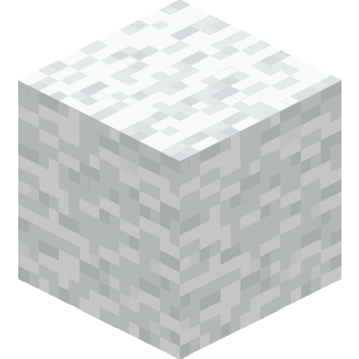

# Synthetic Leather

[🇧🇷 Português](synthetic-leather.md) • 🇺🇸 English

An alternative to leather that can be crafted without having to harm animals.

---

## 🌱 Overview

**Synthetic Leather** is a new item added by the **Animal Friendly Craft Add-on** as an alternative way to obtain leather during survival gameplay.

It can be crafted using materials obtained without having to harm animals and, once crafted, can be converted into **vanilla leather**.

This allows the resulting material to be used normally in Minecraft recipes that require leather.

---

## 🧰 Ingredients

To craft **2 Synthetic Leather**, you need:

| Ingredient        | Quantity |
| ----------------- | -------: |
| Paper             |        4 |
| Bamboo            |        4 |
| Wool of any color |        1 |

> The wool can be **any of the 16 colors available in Minecraft**.

&nbsp;&nbsp;

&nbsp;&nbsp;

---

## 🛠️ Crafting Recipe

Synthetic Leather is crafted in a **Crafting Table** using the following arrangement:

<table>
  <tr>
    <th>Ingredients</th>
    <th>Recipe</th>
    <th>Result</th>
  </tr>
  <tr>
    <td>
      4× Paper 
      4× Bamboo 
      1× Wool of any color
    </td>
    <td align="center">
      <table>
        <tr>
          <td></td>
          <td></td>
          <td></td>
        </tr>
        <tr>
          <td></td>
          <td></td>
          <td></td>
        </tr>
        <tr>
          <td></td>
          <td></td>
          <td></td>
        </tr>
      </table>
    </td>
    <td align="center">
       
      <strong>2× Synthetic Leather</strong>
    </td>
  </tr>
</table>

---

## 🔄 Conversion to Leather

Synthetic Leather can be converted directly into **vanilla leather**.

<table>
  <tr>
    <th>Ingredients</th>
    <th>Recipe</th>
    <th>Result</th>
  </tr>
  <tr>
    <td>
      1× Synthetic Leather
    </td>
    <td align="center">
      <table>
        <tr>
          <td></td>
          <td></td>
          <td></td>
        </tr>
        <tr>
          <td></td>
          <td></td>
          <td></td>
        </tr>
        <tr>
          <td></td>
          <td></td>
          <td></td>
        </tr>
      </table>
    </td>
    <td align="center">
       
      <strong>1× Vanilla Leather</strong>
    </td>
  </tr>
</table>

This conversion allows the resulting leather to be used normally in vanilla Minecraft recipes.

---

## ⚙️ Technical Information

| Property      | Value                   |
| ------------- | ----------------------- |
| Name          | Synthetic Leather       |
| Identifier    | `cpv:synthetic_leather` |
| Type          | Custom item             |
| Behavior Pack | `cpv_animal_friendly`   |
| Resource Pack | `cpv_animal_friendly`   |

---

[⬅️ Back to project documentation](../README.en-US.md)

